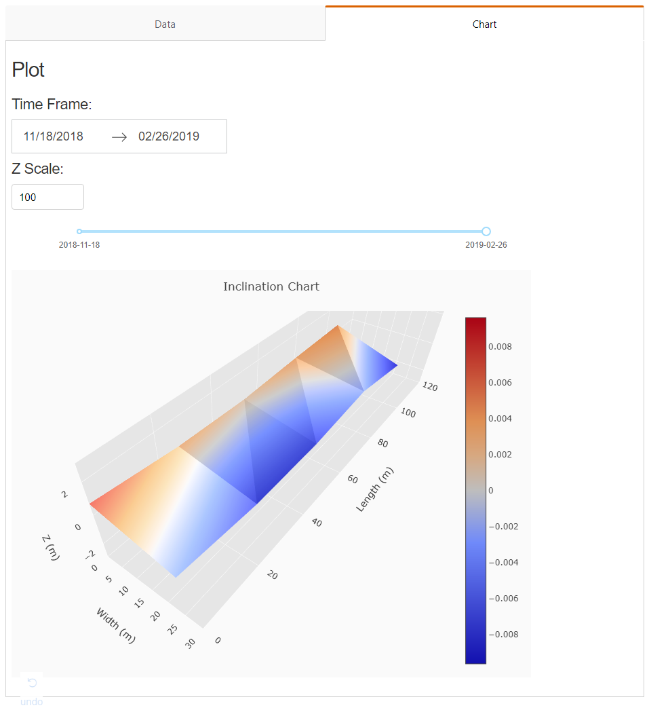

# Setting Up

I'll start where we left off with the Serverless Framework. The goal of this guide is to explore how to build a data-driven web application and address common business concerns like authentication, analysis tools usage, and sleek, usable frontend. I'm also trying to demonstrate usage of various modern web technologies while spending as little effort as possible :)

### Setting Goalposts

#### Existing Conditions

We have a small app written in Dash Components (Python wrappers that allow wiring up frontend pages and widgets to a Flask server without actually writing frontend code) that accesses a Google Sheets document, ingests a dataset of sensors from there, and outputs it as a surface on a Dash plot. It's using Flask backend wrapped around Dash and is deployed on AWS Lambda as a monolithic app since that's what Dash does. It looks like this:

If you're not interested in which code in the old app survives the migration to the new stack and which doesn't, you don't need to have the old app repo, I'm starting with a new repo. Otherwise, you may want to [clone the old repo](https://github.com/bausk/onilapp).

#### Desired Outcome

- Static or zero-config-to-serve frontend written in an established React-based framework that requires minimum effort to set up.
- Authentication and authorization. We only want whitelisted users to access the content, and we want to explore solutions

### Things to Consider

We start with an existing app deployed on either AWS Lambda or EBS. These are some issues I considered. I'll spare the details so here's a digest of choices I would consider optimal for a small-to-medium project.

- Q: Should I continue developing by editing the current monolithic repository or start from scratch and move code from the old repo as I go along?

A: I chose to start from scratch because only certain functions will remain from current MVP.

- Q: How services and API endpoints should be structured?

A: This has several answers. Having one service seems clumsy; with separate `serverless.yml` files we can deploy frontend and backend changes separately which is probably what we would want to do on a serious production-grade project. Overall options are following:

1. Having automatically managed API gateway with one service, one `serverless.yml`, and several runtimes (see [reference here](https://serverless.com/blog/building-mutliple-runtimes/)). This has cons of being complex to setup and clumsy to maintain and deploy.

2. API Gateway managed by SLS, mounting several microservices to it. Very clumsy to set up, needs good knowledge of AWS config files/specs.

3. Using autogenerated API Gateways as a template, create and manually update a single API Gateway and mount `api` and `app` microservices to it. This seems the easiest solution for a small-medium SPA so I went with this one.

### Setting Up

#### Setting Up - Frontend

Checkout the `v1.0` tag from the sample app repo to proceed.

Next.js allowed me to hit the ground running with the frontend so I'm going to go through with it. The reference document for the start was [Crash Course on SSR with Next.js and AWS Lambda](https://dev.to/adnanrahic/a-crash-course-on-serverless-side-rendering-with-reactjs-nextjs-and-aws-lambda-13ed).

The `serverless.yml` for the app looks like this:

You should provision an SSL certificate for your staging subdomain, to use it to setup your API gateway.

https://auth0.com/docs/flows/concepts/single-page-login-flow
